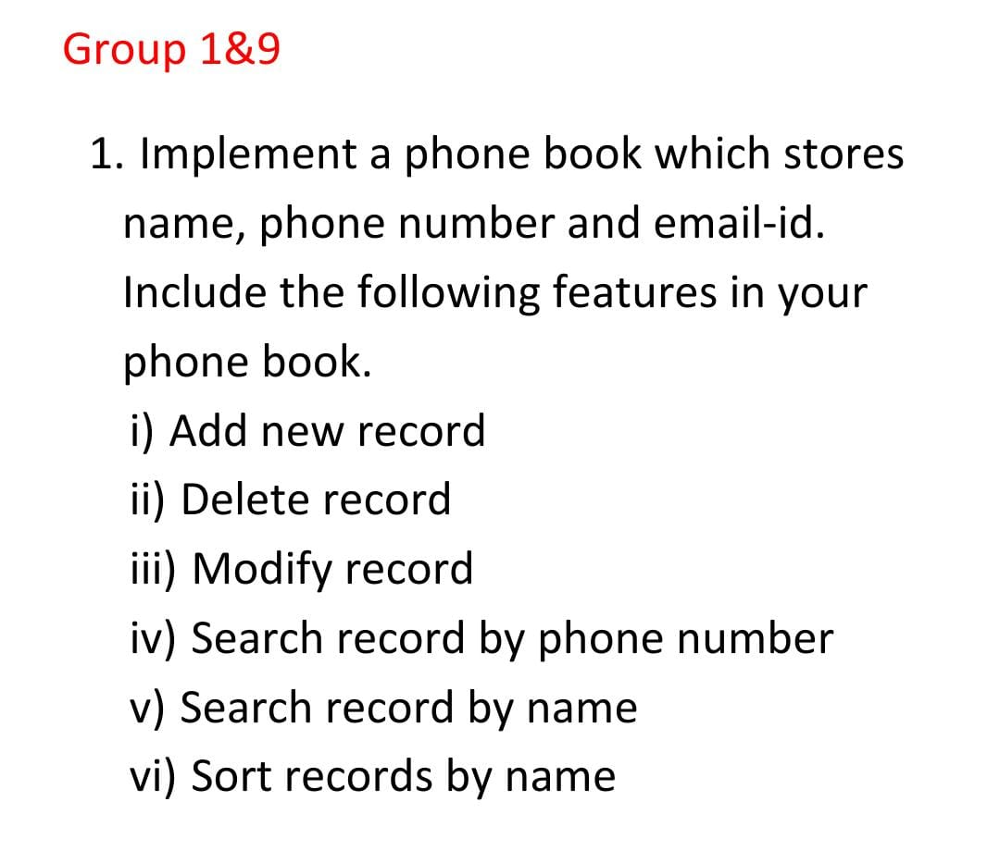

# Basic Phonebook
Basic implementation of a Phonebook in C language.

## Problem Statement
Implement a phone book which stores name, phone number and email-id. Include the following features in your phone book.
 - Add new record
 - Delete record
 - Modify record
 - Search record by phone number
 - Search record by name
 - Sort records by name
## Credits 
Implemented by Group 9 of R3A for DS Assignement Dec 2021.
### Team
 - George P Zacharia  
 - Gokul PS
 - Gokul Raj
 - Greeshma Biju R
